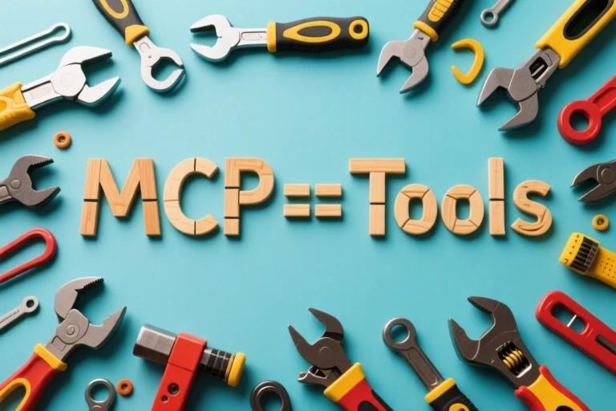
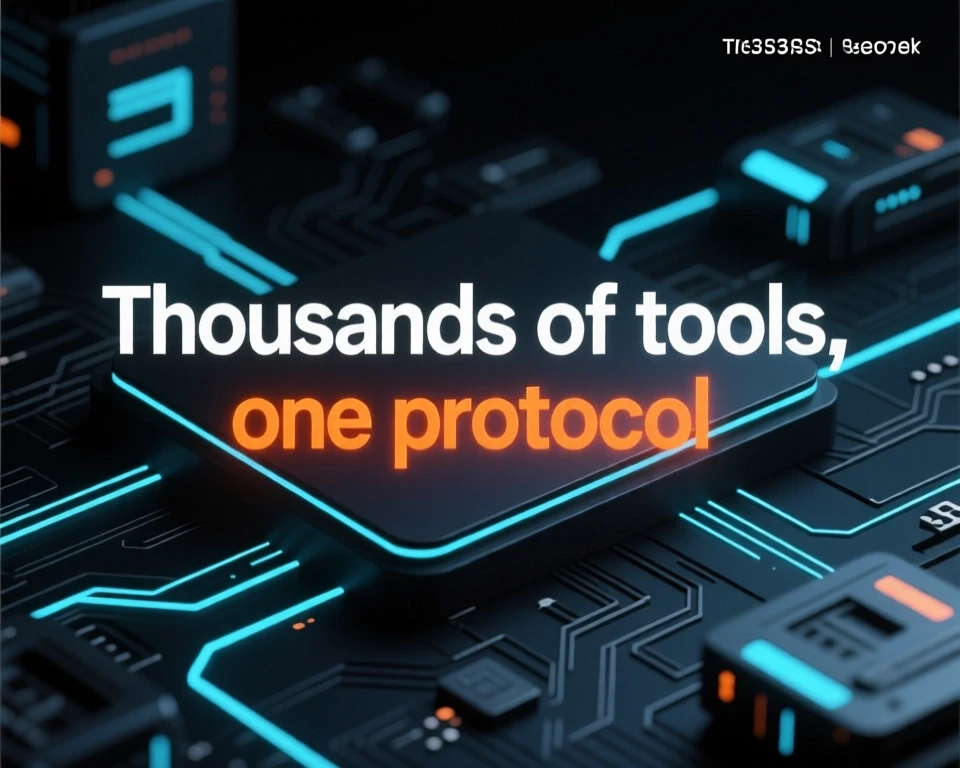

<!-- _class: lead -->
<!-- _backgroundColor: "#312C31" -->

# 👋 About Me

### **Joshua Frank**
**Co-Founder & Lead Developer – Tesseract Mobile**

I’m a self-taught developer, robotics enthusiast, and AI tinkerer  
based in **St. Louis, Missouri**.  

Over the last decade, I’ve built and launched multiple mobile apps,  
managed GPU inference clusters, and developed open-source tools for  
creative AI workflows — including **MonAI: Art Generator**.

[GitHub – frankjoshua](https://github.com/frankjoshua)
josh@joshfrank.com  

<!-- presenter: 
Hey everyone — I’m Joshua Frank. I’ve spent a lot of time building apps and experimenting with AI, mostly trying to make it actually useful in day-to-day work instead of just answering questions.

Today I want to show you something that makes that possible — it’s called the Model Context Protocol, or MCP. It’s a way for AI to connect with the tools and data we already use, without all the messy integrations.

Please feel free to ask questions at any time. If it's something that I will cover later I'll ask you to hold the question for a bit.
-->

---

## What Is MCP (Model Context Protocol)?

- MCP is a way for AI to work with the tools you already use.  

- Right now, most AIs just talk — you ask something, it answers.  

- MCP lets them actually do things — plug into your calendar, notes, files, or gadgets to help directly.

<!-- presenter: 
So at a high level, MCP is about letting AI actually do things — not just talk.

Most AI systems today are basically chat-only. You ask a question, it answers, and that’s the end of it. There’s no real connection to your files, your calendar, your tools — none of the stuff you actually use to get work done.

MCP changes that. It gives AI a standard way to interact with the same tools we use every day — like reading a document, creating a task, or even controlling a device — but in a way that’s consistent and safe.

You can think of it as giving structure to how models plug into the real world, instead of relying on one-off integrations or custom APIs.
-->

---

## What Is MCP?

- A **standard way** for AI models to connect to real-world tools and data  
- Think of it as a **universal adapter** between models and apps  
- Lets AI safely read info (like calendars or docs) and take action (like creating issues or sending reports)

<!-- presenter: This slide builds on the last one — now that we know *why* MCP matters, here’s what it actually is. MCP is a **standard** way for AI models to connect to real-world tools and data. You can think of it like a universal adapter — it sits between the AI and whatever apps or systems you already use. Instead of writing a custom integration for every tool, MCP defines a shared language that any model or app can understand. So whether it’s reading your calendar, pulling a document, or creating a GitHub issue — it all happens through the same consistent protocol. That’s what makes it powerful: it’s simple, open, and reusable. -->

---

## How Do LLMs Use Tools

<iframe
  width="80%"
  height="400"
  src="https://www.youtube.com/embed/l5wvqKcqL7c"
  title="Meeseeks Example"
  frameborder="0"
  allow="accelerometer; autoplay; clipboard-write; encrypted-media; gyroscope; picture-in-picture; web-share"
  allowfullscreen
></iframe>

- LLMs have no true memory — context must be fed back in.  
- Tool calls are just structured text responses interpreted by the host app.

<!-- presenter: This clip is from the show *Rick and Morty* — it’s the “Mr. Meeseeks” episode. The Meeseeks are a great analogy for how LLMs use tools. You summon one, give it a goal — like “help me take two strokes off my golf game” — and it immediately focuses on completing that one task. Once it’s done, it disappears. LLMs work the same way. Each prompt is like spawning a new Meeseeks — it has no memory of the past, no persistence — just a temporary burst of reasoning to achieve the goal it was given. When we give an LLM access to tools, it’s basically like handing the Meeseeks a toolbox. MCP defines what’s *in* that toolbox and how the model can use it safely — without breaking things or needing a totally new set of instructions every time. -->

---

## The Protocol: Core Structure

MCP defines a standard format for exchanging structured information between models and tools.

- **Tools** – callable functions the model can invoke  
- **Resources** – data or context available to the model  
- **Prompts** – reusable prompt templates exposed by tools  

Each is described in a consistent JSON schema, so any LLM or app can discover and use them safely

<!-- presenter: Here’s where we get into the actual structure of the protocol. MCP defines a common format — kind of like an API contract — for how models and tools talk to each other. Everything flows through three main concepts: **Tools** are functions the model can call — things like `create_issue` or `get_weather`. **Resources** are pieces of data or context the model can access — like a list of documents, a calendar, or recent messages. And **Prompts** are predefined templates that tools can expose — so instead of hardcoding instructions, the model can discover reusable prompts dynamically. All of this is wrapped in a consistent JSON schema. That’s what makes it interoperable — any LLM or app that understands MCP can discover available tools and use them safely, without needing custom glue code. -->

---

## The Protocol: Utilities & Extensions

Beyond the core objects, MCP supports rich capabilities for real-world use:

- **Completion** – enables interactive experiences and autocompletion  
- **Logging** – structured event logs and telemetry  
- **Pagination** – large results streamed in manageable chunks  
- **Streaming** – continuous updates for long-running tools  

These features make MCP practical for both human-facing and automated systems.

<!-- presenter: Once you have the core building blocks — tools, resources, and prompts — MCP adds a bunch of utilities that make it practical in the real world. **Completion** is what allows interactive or assisted workflows — like autocomplete in an IDE or conversational suggestions. **Logging** gives structured event data, so you can track what tools were used, when, and how — really important for observability and debugging. **Pagination** lets large datasets be broken up into smaller chunks, so the model doesn’t get overwhelmed trying to process everything at once. And **Streaming** supports long-running tasks — so you can get partial results or progress updates in real time. Together, these extensions make MCP not just a protocol — but a foundation for building robust, real-time AI systems that work seamlessly with humans and software. -->

---

## MCP = Tools

- At its core, MCP is a universal way for AI to **use tools.**    

<!-- presenter: MCP = Tools might sound overly simple, but it captures the essence perfectly. Underneath, there’s a lot of structure — schemas, discovery, permissions, logging — but all of that exists just to make tool use safe and predictable. The point isn’t that MCP *is only* tools, it’s that everything in the protocol ultimately supports that goal: giving models a reliable way to take action through external systems. It’s a simple statement that helps keep the focus on what actually matters — enabling AI to interact with the world through well-defined tools, not ad-hoc integrations. -->

---

## How It Works

1. **MCP Server** lists available tools and data schemas  
2. **LLM** chooses the right tool and fills in inputs  
3. **App** executes the call via the MCP server → returns results  
4. **Model** uses that output to continue reasoning  

**Example Flow:**  
> User: “Create a GitHub issue”  
> → Model calls `create_issue(title, body)`  
> → MCP executes → returns link  
> → Model replies: “Issue created: [link]”

<!-- presenter: Here’s what actually happens under the hood when MCP is in use. First, an **MCP server** advertises the tools and data it offers — basically a menu of capabilities. The **LLM** then looks at the user’s request and decides which tool fits best, filling in the inputs as structured data. The **app** — which acts as the host — sends that request to the MCP server, which executes the action and returns the results. Finally, the **model** takes that output and uses it in its next response. In the GitHub example, the model doesn’t know how to write an API call — it just knows there’s a `create_issue` tool. It calls it, MCP handles the request, and the model gets back a link it can share. That whole cycle is what turns language models into useful agents that can actually *do* things in the real world. -->

---

## MCP vs RAG

- MCP enables bidirectional, tool-aware interactions — the model can call, discover, and use tools or context providers during reasoning.

- RAG is unidirectional — the model retrieves text snippets before generation, but doesn’t interact with tools or update context dynamically.

RAG:  User → Retriever → Model → Output  (one way)
MCP:  User ↔ Model ↔ Tools  (bidirectional)

<!-- presenter: So you might be thinking — *should I just use RAG for this?* And the answer is: maybe… but probably not, at least not by itself. RAG is great when all you need is extra context — pulling in documents, notes, or knowledge before the model responds. But once you need the model to actually *do* something — update a record, send data, trigger an action — RAG alone hits a wall. That’s where MCP comes in. It doesn’t replace RAG — it complements it. RAG feeds the model information; MCP lets it act on that information. So if your goal is anything more interactive than “read and reply,” MCP is usually the better fit. -->

---

## MCP vs API

- Dynamic discovery – Tools are found and described automatically.

- Context-aware – AI understands when and how to use each tool.

- Plug-and-play – Add or remove tools without changing code.

<!-- presenter: You might ask — *why not just use our existing API?* Why add another layer? The short answer is: because LLMs don’t think like developers. Even a simple REST call can be confusing for a model — too many parameters, authentication quirks, payloads that have to be perfectly structured. A single mismatch and the whole request breaks. MCP solves that by giving the model a clear, structured description of each tool — what it does, what inputs it expects, and how to use it safely. The second big advantage is **discoverability**. With normal APIs, the model can only use what we hardcode into it. With MCP, it can ask, “What tools are available?” and automatically learn how to use new ones. That makes it adaptable — you can evolve your system over time without rewriting prompts or retraining the model. -->

---

## Why It Matters

- No more custom integrations — one shared language for all AI tools  

- Already widely supported across AI platforms

<!-- presenter: This is where everything comes together — why MCP actually matters. Right now, every AI system reinvents the wheel. Each app builds its own plugin system, its own format, its own way of connecting to data or APIs. None of them talk to each other. MCP changes that by introducing a *shared language* for tool use — so one integration can work across different platforms, models, and ecosystems. And that’s not theoretical — it’s already gaining traction. OpenAI, Anthropic, Figma, and GitHub are all adopting or aligning with MCP in some form. So instead of a fragmented mess of APIs and plugins, we get a single, open standard that lets everything interoperate — models, tools, and platforms all speaking the same language. -->

---

## The Compounding Power of Tool Use

- Intelligence grows not by bigger brains but by better tools.  
- **Humans:** writing → science → computers → internet  
- **LLMs:** memory → APIs → specialty models → real-world actuators  
- Each tool amplifies capability, creating a feedback loop.  

<!-- presenter: We’ve all seen how scaling up language models has driven massive progress — bigger datasets, more parameters, more compute — but that curve is starting to flatten out. Each new model still improves, but the gains are smaller, and the cost grows exponentially. We’re hitting practical limits in data, hardware, and even useful signal. That’s where tools come in. Tools effectively *extend* the capabilities of a model without needing to make it bigger. Instead of memorizing every possible fact or workflow, the model can simply use the right tool — fetch real data, run code, or take action in the world. So while pure scale is tapering off, tool use opens a new frontier. It shifts the focus from “how large can the model be?” to “how well can it use what already exists?” That’s where MCP really shines — it makes that extension scalable and standardized. -->

---

## Example MCP Tools in Action

- **Productivity & Collaboration:** create and assign tasks, update docs, book meetings  
- **Data & Knowledge Access:** query databases, fetch market data, search wikis  
- **Infrastructure & DevOps:** deploy code, restart servers, run pipelines  
- **Business Ops:** manage tickets, process orders, update CRM  
- **Robotics & IoT:** control sensors, move robotic arms  
- **Specialized Models:** legal, financial, or creative expert calls  

<!-- presenter: These examples show how broad MCP’s reach can be once tools start speaking the same language. In **productivity and collaboration**, a model could create tasks, summarize meetings, or update documentation directly inside your team’s tools — no glue code required. In **data and knowledge access**, it might query a live database, fetch the latest market data, or search through internal wikis — all through a consistent MCP interface. For **infrastructure and DevOps**, an agent could deploy code, restart a crashed server, or monitor a pipeline, safely and with full logging. And it doesn’t stop there — **business ops**, **robotics**, **IoT**, even **specialized expert models** can all plug into the same protocol. The important part is: these aren’t separate ecosystems anymore. MCP makes it possible for all these capabilities to coexist and be orchestrated by a single reasoning model. -->

---

## From Concept to Reality

MCP isn’t theoretical — it’s already powering tools you use daily.

<!-- presenter: Up to this point, everything about MCP might sound conceptual — like a blueprint for how AI *could* work better. But this isn’t a future idea; it’s already happening. The next slide highlights where MCP is already showing up in real products — powering tools you probably use every day. It’s not just an emerging standard; it’s quickly becoming the backbone for how modern AI systems discover, describe, and use tools in the real world. -->

---

## MCP in the Wild

- OpenAI – MCP powers ChatGPT’s new Agents SDK, enabling dynamic tool discovery.

- Anthropic – Originator of the protocol, used across Claude and open-source reference servers.

- Figma – Uses MCP to connect design files to developer tools and code systems.

- GitHub / VS Code – Extensions use MCP to let AI agents manage repos, run tests, and write code.

- Community Servers – Open ecosystem of connectors for Slack, Notion, Stripe, PostgreSQL, and more.

<!-- presenter: What’s exciting here is how many major players are already adopting MCP. This isn’t just a niche experiment — companies like OpenAI, Anthropic, GitHub, Figma, and others are all using the same underlying protocol to connect their AI systems to tools and data. That kind of convergence is rare in tech — especially this early. It means the ecosystem is aligning around a shared standard for how AI interacts with the world. So when you hear “MCP,” think of it less as a new product and more as the common language that’s quietly stitching all these platforms together. -->

---

## MCP Directories

- Over **6,000 services** available  
- [https://www.pulsemcp.com/servers](https://www.pulsemcp.com/servers)

<!-- presenter: One of the coolest parts of this ecosystem is how quickly it’s growing. There are already thousands of MCP-compatible tools and servers available — everything from productivity apps and databases to robotics and creative tools. Sites like **PulseMCP** act as directories, making it easy to browse and discover what’s out there. Think of it like an app store for AI capabilities — each entry is a service the model can talk to directly through the protocol. That scale is what makes MCP so powerful. It’s not just a framework — it’s becoming a living network of interoperable tools, all ready for AI to plug into. -->

---

## Demo

- Control a simulated robot through LLM chat and MCP  

<!-- presenter: This demo is just a simple proof of concept — the robot doesn’t do anything fancy yet, it just navigates to a given location. But that’s the point. There’s no hardcoded logic or special API integration behind it — the model is using MCP to discover and call a navigation tool on its own. Even at this basic level, it shows that an LLM can understand intent, translate that into structured tool calls, and get a real response back. It’s a small example, but it’s a big shift: the start of AI systems that can reason *and* act, using a consistent, open protocol. -->

---

## The Future of MCP

- A shared language for all AI tools and platforms

- Seamless interoperability between agents, apps, and devices

- From chat assistants → to fully capable digital coworkers

MCP isn’t about one model doing everything —
it’s about every model doing something well and working together.

<!-- presenter: If you zoom out a bit, the bigger story here is interoperability. We’re moving toward a world where every app, model, and device can speak the same language — and that language is MCP. Instead of one giant, all-knowing model trying to do everything, we’ll have networks of smaller, specialized systems — each great at one thing, all coordinating through this shared protocol. That’s what makes MCP powerful: it’s not just a standard for tool use; it’s the foundation for collaboration between intelligent systems. It’s how we move from chatbots to capable digital coworkers — and eventually, AI that works with us, not just for us. -->