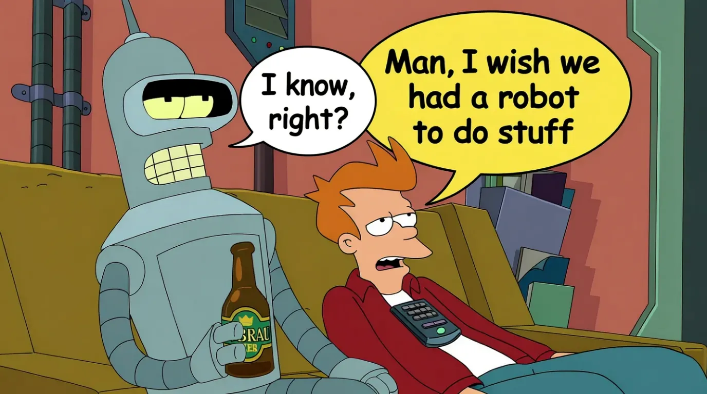

<!-- _class: lead -->
<!-- _backgroundColor: "#312C31" -->

# 👋 About Me

### **Joshua Frank**
**Co-Founder & Lead Developer – Tesseract Mobile**

I’m a self-taught developer, robotics enthusiast, and AI tinkerer  
based in **St. Louis, Missouri**.  

Over the last decade, I’ve built and launched multiple mobile apps,  
managed GPU inference clusters, and developed open-source tools for  
creative AI workflows — including **MonAI: Art Generator**.

[GitHub – frankjoshua](https://github.com/frankjoshua)
josh@joshfrank.com  

---

## What Is MCP?

MCP is a way for AI to work with the tools you already use.  
Right now, most AIs just talk — you ask something, it answers.  
MCP lets them actually do things — plug into your calendar, notes, files, or gadgets to help directly.

---

## What MCP Is?

- A **standard way** for AI models to connect to real-world tools and data  
- Think of it as a **universal adapter** between models and apps  
- Lets AI safely read info (like calendars or docs) and take action (like creating issues or sending reports)

---

## How Do LLMs Use Tools

<iframe
  width="80%"
  height="400"
  src="https://www.youtube.com/embed/l5wvqKcqL7c"
  title="Meeseeks Example"
  frameborder="0"
  allow="accelerometer; autoplay; clipboard-write; encrypted-media; gyroscope; picture-in-picture; web-share"
  allowfullscreen
></iframe>

- LLMs have no true memory — context must be fed back in.  
- Tool calls are just structured text responses interpreted by the host app.

---

## The Protocol

- MCP returns structured responses describing:
  - **Tools**
  - **Resources**
  - **Prompts**
- It’s the language that lets AIs and apps communicate cleanly.

---

## How It Works

1. **MCP Server** lists available tools and data schemas  
2. **LLM** chooses the right tool and fills in inputs  
3. **App** executes the call via the MCP server → returns results  
4. **Model** uses that output to continue reasoning  

**Example Flow:**  
> User: “Create a GitHub issue”  
> → Model calls `create_issue(title, body)`  
> → MCP executes → returns link  
> → Model replies: “Issue created: [link]”

---

## Why It Matters

- No more custom integrations — one shared language for all AI tools  
- Already widely supported across AI platforms

---

## The Compounding Power of Tool Use

- Intelligence grows not by bigger brains but by better tools.  
- **Humans:** writing → science → computers → internet  
- **LLMs:** memory → APIs → specialty models → real-world actuators  
- Each tool amplifies capability, creating a feedback loop.  
- **Key takeaway:** Connecting models to tools multiplies what AI can do.

---

## MCP = Tools (Definition Slide)

- At its core, MCP is a universal way for AI to **use tools.**  
- Think of it as the connective tissue letting a model reach beyond itself.  
- Simple message: **MCP == Tools**  
- Visual: bold text MCP = Tools → memory, APIs, robotics, specialty models

---

## Inside MCP

- Bi-directional streaming for live updates  
- Capability negotiation for discovery  
- Secure, auditable execution  

---

## Example Provider

- **Context:** live project tasks  
- **Tools:** createTask, assignTask, markDone  
- **Visual:** live MCP session screenshot

---

## Example MCP Tools in Action

- **Productivity & Collaboration:** create and assign tasks, update docs, book meetings  
- **Data & Knowledge Access:** query databases, fetch market data, search wikis  
- **Infrastructure & DevOps:** deploy code, restart servers, run pipelines  
- **Business Ops:** manage tickets, process orders, update CRM  
- **Robotics & IoT:** control sensors, move robotic arms  
- **Specialized Models:** legal, financial, or creative expert calls  

---

## Business & Ecosystem Impact

- No vendor lock-in  
- Open marketplace of reusable providers  
- Visual: ecosystem diagram

---

## MCP Directories

- Over **6,000 services** available  
- [https://www.pulsemcp.com/servers](https://www.pulsemcp.com/servers)

---

## Demo

- Local in-browser MCP robot face  
- Control a simulated robot through LLM chat and MCP  

